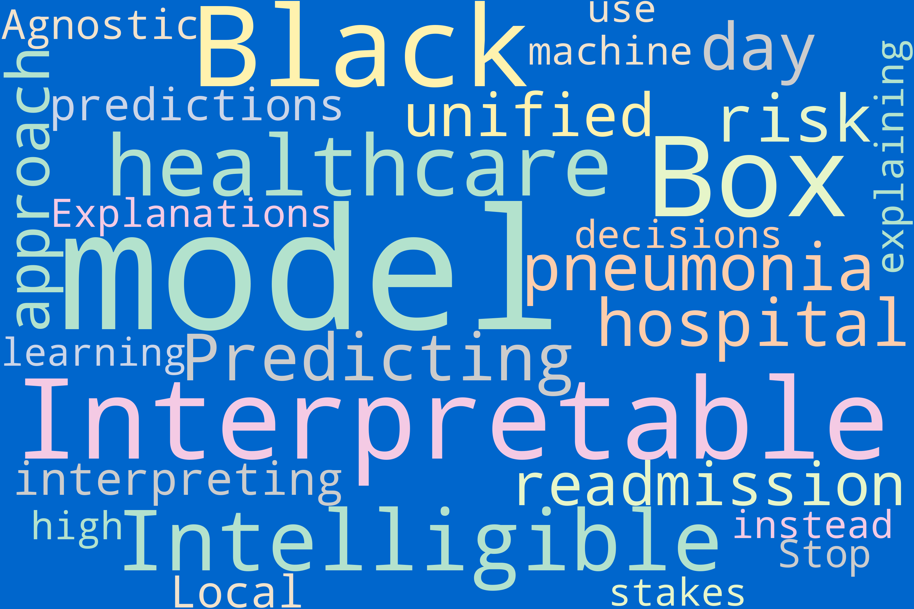
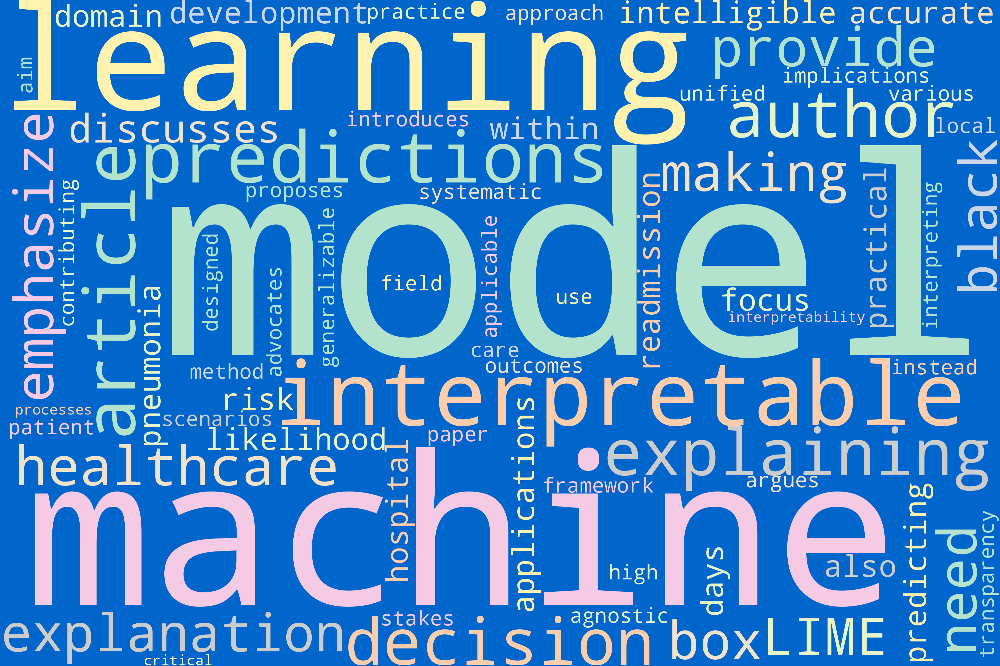
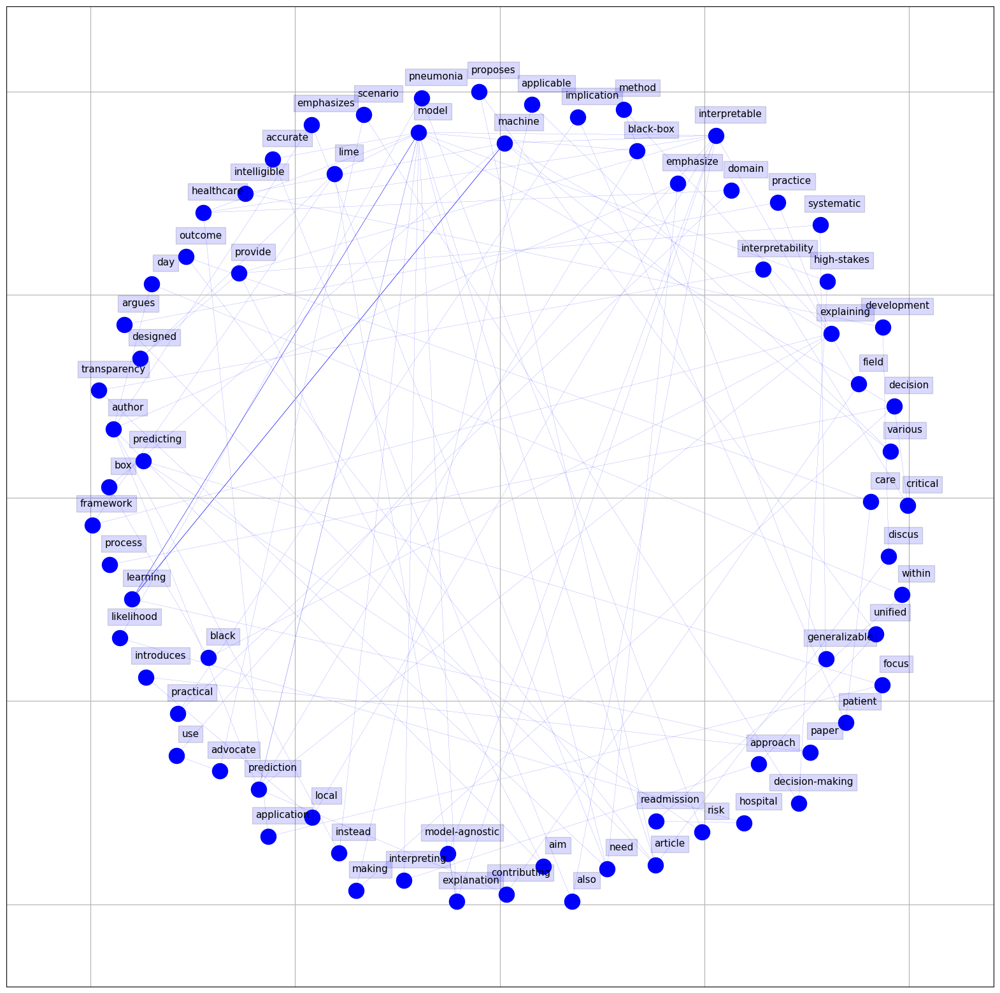
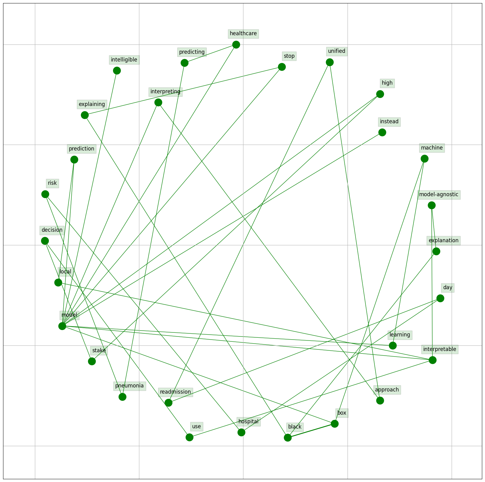

The NLP analysis commenced with data preprocessing for two selected topics, one in blackbox model and the other in consumer reviews. Text was cleaned, tokenized, and summarized to distill key themes. Topic modeling and keyword extraction unveiled primary research areas and essential terms. Sentiment analysis assessed overall sentiment. A comparative analysis showed that the healthcare paper emphasized interpretable models in predicting pneumonia risk and readmissions. The consumer reviews paper focused on explainable AI, employing linguistic rules for model reconstruction. Both addressed interpretable models but in different domains. This analysis revealed valuable insights into healthcare and consumer review applications of interpretable AI.

# Natural Language Processing Visualizations in Global reconstruction of language models with linguistic rules 
– Explainable AI for online consumer reviews Literature

## Woldcloud

### Title

<figure>
    
    <figcaption><strong>Figure 1:</strong> Title Word Cloud for the Literature</figcaption>
    
<em>Notes:</em> This word cloud represents the most frequently used words in the dataset fo Literare in XXX's titles. Larger words were used more often.

</figure>

### Abstract

## Bigram 

### Title

###  Abstract

